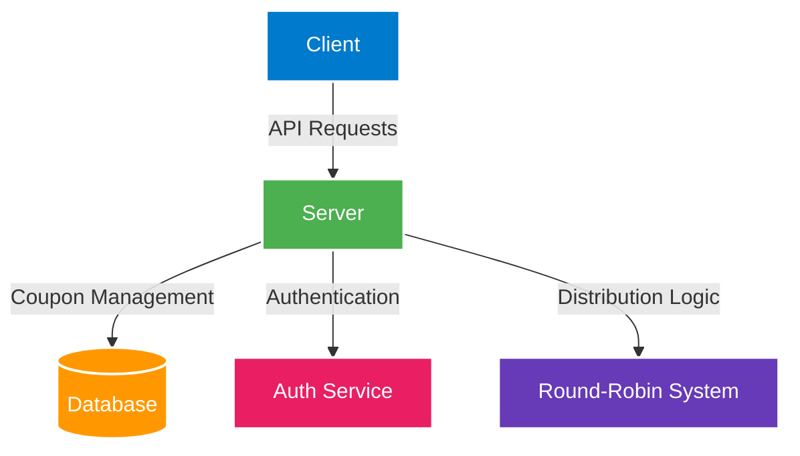

# CouponsLoop 🎫

A modern, real-time coupon distribution platform built with React, TypeScript, and a focus on fair distribution through a round-robin system.

**Live Demo:** [CouponsLoop](https://coupons-loop.vercel.app/)

## Table of Contents
- [Overview](#overview)
- [Features](#features)
- [Architecture](#architecture)
- [Key Components](#key-components)
- [Installation](#installation)
- [Usage](#usage)
- [Technical Stack](#technical-stack)
- [Contributing](#contributing)

## Overview

CouponsLoop is a platform designed to distribute coupons fairly and efficiently. It implements a round-robin distribution system to ensure equal access to deals, with no account creation required for basic usage.

## Features

### Core Features
- 🚀 Instant coupon access without registration
- 🔄 Fair round-robin distribution system
- 🛡️ Advanced protection against abuse
- ⚡ Real-time coupon status updates
- 🌓 Dark/Light mode support
- 📱 Responsive design

### How It Works


### System Architecture



## Key Components


### Feature Highlights
- **Instant Access**: No account required for basic functionality
- **Round-Robin Distribution**: Fair allocation system
- **Security**: Protected against abuse and exploitation
- **Fresh Content**: Regular updates of available coupons
- **Admin Dashboard**: Complete coupon management system

## Technical Stack

- **Frontend:**
  - React with TypeScript
  - Framer Motion for animations
  - Tailwind CSS for styling
  - Shadcn UI components
  
- **Backend:**
  - ExpressJs
  - NodeJs
  - TypeScript
  - MongoDB (Database)

- **Key Libraries:**
  - Lucide Icons
  - React Router
  - Framer Motion

## Installation

1. Clone the repository
```bash
git clone https://github.com/vishdadhich092004/CouponsLoop
```

2. Install dependencies
```bash
cd CouponsLoop
npm install (for both server and client)
```

3. Start the development server
```bash
npm run dev (for both client and server)
```

## Usage

### For Users
1. Visit the platform
2. Click "Get Coupon" button
3. Copy the provided code
4. Use at checkout on merchant's website

### For Administrators
1. Access the admin dashboard
2. Manage coupons (create, update, expire)
3. Monitor distribution and usage
4. View analytics and reports

## Contributing

1. Fork the repository
2. Create your feature branch (`git checkout -b feature/AmazingFeature`)
3. Commit your changes (`git commit -m 'Add some AmazingFeature'`)
4. Push to the branch (`git push origin feature/AmazingFeature`)
5. Open a Pull Request


---

Built with ❤️ by Vishesh
